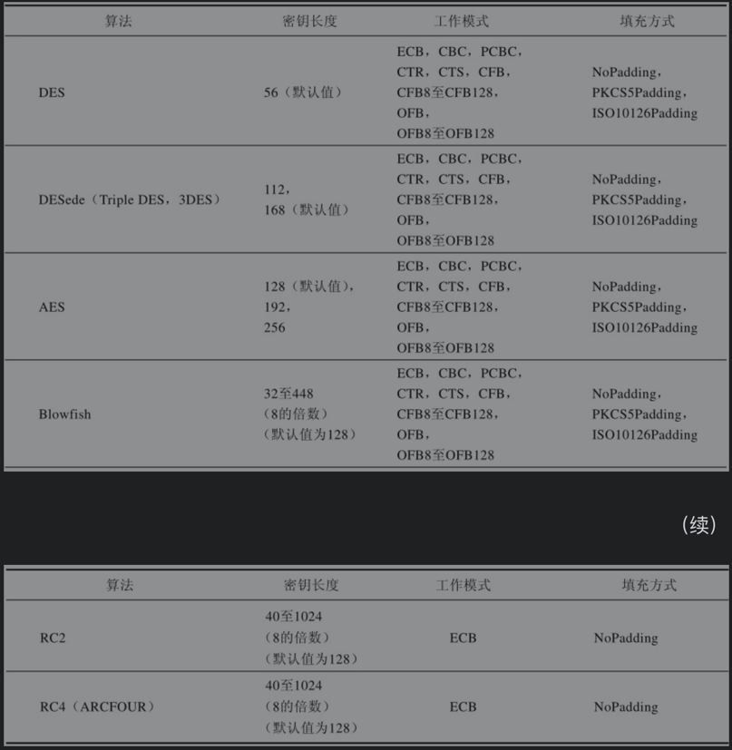

## Key
> Key接口是所有密钥接口的顶层接口，一切与加密解密有关的操作都离不开Key接口
### 所有的秘钥都具有三个特征:
  * 算法,这里指的是秘钥的算法
  * 编码形式, 这里指的是秘钥的外部编码形式,秘钥根据标准格式编码
  * 格式 编码秘钥格式名称
## SecretKey
> SecretKey（javax.crypto.SecretKey）接口是对称密钥顶层接口。DES、AES等多种对称密码算法密钥均可通过该接口提供，PBE（javax.crypto.interfaces.PBE）接口提供PEB算法定义并继承了该接口。Mac算法实现过程中，通过SecretKey接口提供秘密密钥。通常使用的是SecretKey接口的实现类SecretKeySpec（javax.crypto.spec.SecretKeySpec）。
## PublicKey和PrivateKey
> PublicKey、PrivateKey接口是非对称密钥顶层接口。KeyPair类包括两个信息: 公钥和私钥

## KeyPair
> KeyPair类是对非对称密钥的扩展，它是密钥对的载体，我们把它称为密钥对。

## KeySpec
> 此接口不包含任何方法或常量。它仅用于将所有密钥规范分组，并为其提供类型安全。所有密钥规范都必须实现此接口。
> KeySpec的抽象实现类（EncodedKeySpec）构建了用于构建公钥规范和私钥规范的两个实现（X509EncodedKeySpec用于构建公钥规范，PKCS8EncodedKeySpec用于构建私钥规范）。
> SecretKeySpec接口是KeySpec的实现类，用于构建秘密密钥规范。
### X509EncodedKeySpec
> 用于转换公钥编码密钥
### PKCS8EncodedKeySpec
> 用于转换私钥编码密钥
### 
## KeyGenerator

## KeyPairGenerator
## Base64

> base64是网络上最常见的用于传输8Bit字节码的可读性编码算法之一

### 特点

* 可读性编码算法不是为了保护数据的安全性,而是为了可读性
* 可读性编码不改变信息内容,只改变了信息内容的表现形式
* 所谓Base64,即是说在编码过程中使用了64中字符,包括A-Z a-z 0-9 + =
* Base64以每3位字节为一组,3 * 8 = 24个bit位,然后24bit位以每6个bit位为一组,分为4组.每一组为6个bit,每一组最前面补2个0,计算10进制数, 然后对照Base64编码表,得出对应的符号
* 如果不够分4组的,空缺的就用=补齐

## 对称加密
[分组密码](https://zh.wikipedia.org/wiki/%E5%88%86%E7%BB%84%E5%AF%86%E7%A0%81%E5%B7%A5%E4%BD%9C%E6%A8%A1%E5%BC%8F)

* DES:数据加密标准(Data Encryption Standard)
  > DES秘钥只能为8字节
* AES:高级加密标准(Advanced Encryption Standard)
  > AES秘钥为16字节
* 共同特点:
    * 加密速度快,可以加密大文件
    * 密文可逆,一旦密钥文件泄漏,就会导致数据暴露
    * 加密后编码表找不到对应字符,出现乱码
    * 一般结合Base64使用

## 加密模式

### ECB

ECB:电子密码本(electronic codebook).需要加密的消息按照块密码的块大小被分为数个块,并对每个块进行独立加密
> 

* 缺点:同样的明文块会被加密成相同的密文块,不能很好地保护数据
* 优点:可以并发处理,对于大数据

### CBC

CBC:密码块链接(Cipher-block chaining).每个明文块先与前一个密文块进行异或后，再进行加密。在这种方法中，每个密文块都依赖于它前面的所有明文块
> 

* 优点:同样的原文生成的密文不一样
* 缺点:串行处理数据.

## 填充模式

> 当需要按块处理的数据, 数据长度不符合块处理需求时, 按照一定的方法填充满块长的规则

* NoPadding,不填充.DES==> 8byte的整数倍; AES==> 16byte的整数倍
* PKCS5Padding 数据块的大小为8位, 不够就补足

## 消息摘要(Message Digest)
> 将长度不固定的消息(message)作为输入参数,运行特定的Hash函数,生产固定长度的输出,这个输出就是Hash,也称为这个消息的消息摘要(MessageDigest)
### 散列函数
> 散列函数，又称哈希函数、消息摘要函数、单向函数或杂凑函数。与上述密码体制不同的是，散列函数的主要作用不是完成数据加密与解密的工作，它是用来验证数据完整性的重要技术
#### 散列函数特点
* 消息的长度不受限制
* 如果两个散列值不相同，则这两个散列值的原始输入消息也不相同，这个特性使得散列函数具有确定性的结果
* 散列函数的运算过程是不可逆的，这个特性称为函数的单向性。这也是单向函数命名的由来
* 对于一个已知的消息及其散列值，要找到另一个消息使其获得相同的散列值是不可能的，这个特性称为抗弱碰撞性。这被用来防止伪造
* 任意两个不同的消息的散列值一定不同，这个特性称为抗强碰撞性

> 将长度不固定的消息(message)作为输入参数,运行特点的Hash函数,生成固定长度的输出,这个输出就是Hash,也称为这个消息的消息摘要(Message Digest)

### 常用算法

* MD5 生成的摘要128bit(16byte)
* SHA1 生成的摘要160bit(20byte)
* SHA256 256位(32位)
* SHA512 512位(64位)
* MAC算法

## 非对称加密

### RSA

## 数字证书

