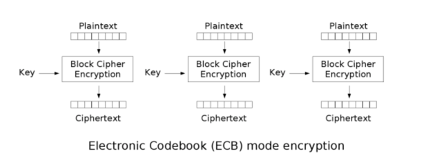

## Base64

> base64是网络上最常见的用于传输8Bit字节码的可读性编码算法之一

### 特点

* 可读性编码算法不是为了保护数据的安全性,而是为了可读性
* 可读性编码不改变信息内容,只改变了信息内容的表现形式
* 所谓Base64,即是说在编码过程中使用了64中字符,包括A-Z a-z 0-9 + =
* Base64以每3位字节为一组,3 * 8 = 24个bit位,然后24bit位以每6个bit位为一组,分为4组.每一组为6个bit,每一组最前面补2个0,计算10进制数, 然后对照Base64编码表,得出对应的符号
* 如果不够分4组的,空缺的就用=补齐

## 对称加密

* DES:数据加密标准(Data Encryption Standard)
  > DES秘钥只能为8字节
* AES:高级加密标准(Advanced Encryption Standard)
  > AES秘钥为16字节
* 共同特点:
    * 加密速度快,可以加密大文件
    * 密文可逆,一旦密钥文件泄漏,就会导致数据暴露
    * 加密后编码表找不到对应字符,出现乱码
    * 一般结合Base64使用

## 加密模式

### ECB

ECB:电子密码本(electronic codebook).需要加密的消息按照块密码的块大小被分为数个块,并对每个块进行独立加密
> 

* 缺点:同样的明文块会被加密成相同的密文块,不能很好地保护数据
* 优点:可以并发处理,对于大数据

### CBC

CBC:密码块链接(Cipher-block chaining).每个明文块先与前一个密文块进行异或后，再进行加密。在这种方法中，每个密文块都依赖于它前面的所有明文块
> 

* 优点:同样的原文生成的密文不一样
* 缺点:串行处理数据.

## 填充模式

> 当需要按块处理的数据, 数据长度不符合块处理需求时, 按照一定的方法填充满块长的规则

* NoPadding,不填充.DES==> 8byte的整数倍; AES==> 16byte的整数倍
* PKCS5Padding 数据块的大小为8位, 不够就补足

## 消息摘要(Message Digest)

> 将长度不固定的消息(message)作为输入参数,运行特点的Hash函数,生成固定长度的输出,这个输出就是Hash,也称为这个消息的消息摘要(Message Digest)

### 常用算法

* MD5 生成的摘要128bit(16byte)
* SHA1 生成的摘要160bit(20byte)
* SHA256 256位(32位)
* SHA512 512位(64位)

## 非对称加密

### RSA

