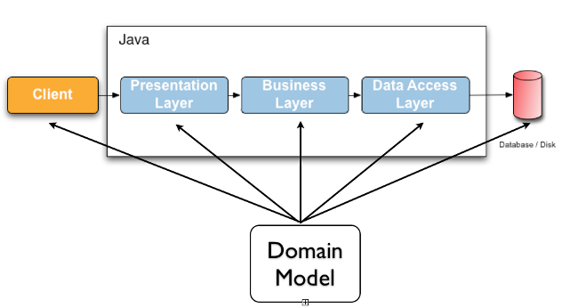

# 1.hibernate validator

# 2.Declaring and validating bean constraints
## 2.1.Declaring bean constraints
* field constraints
  约束放在字段上
* property constraints
  约束方向在get方法上
* container element constraints
  容器元素约束
  * list
  * map
  * set
  * optional  
* class constraints
 类级别的约束
 ## 2.2.约束的继承
* 当一个类 实现 一个接口 或者 继承 另外 一个类,这 父类 或者 父接口 上 所有的 校验约束,都会以同样的方式应用于 该实现类中,
相当于说该类继承了父类或者接口的约束
* 而有一点, 父类方法有 参数校验,而子类重写了父类的方法,同时 覆盖了 父类中同样的 参数校验约束,则会抛出ConstraintDeclarationException  

